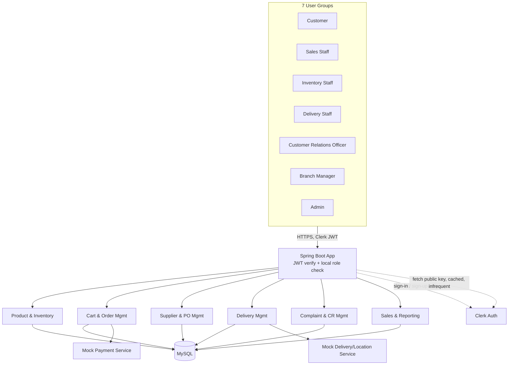

# LankaFresh Online — Product Requirements Document (PRD)

| | |
|---|---|
| **Version** | 1.4 |
| **Date** | August 20, 2026 (final pre-team-share) |
| **Prepared by** | Tharaniben K. |
| **Audience** | LankaFresh Online dev team (6 members) |
| **Course context** | Year 2, Semester 1 group project — Weeks 3–14 |

This document translates the project proposal into a shared technical reference. Read Sections 1–4 fully before you start your module — they define the stack, the repo layout, auth, and the conventions everyone's code needs to follow so the six modules actually fit together at integration time. Section 5 is a deep-dive per module; you mainly need your own subsection plus a skim of the others so you know what you're calling into and what's calling into you.

### What changed since v1.3

**v1.4 (August 20, 2026):** Pre-team-share hardening pass. Added Section 4.10 (coding conventions — CSS variables, DTO example, cross-module call pattern, DB naming, frontend file naming) and Section 9 extended with exact git commands for a teammate starting from a fresh clone. No functional or scope changes.

### What changed since v1.2

**v1.3 (August 20, 2026):** Two updates based on workflow review:
1. Customer flow clarified end-to-end in Section 5.2 (login → browse → add to cart → mock payment → order status) — this is the primary customer journey and every module should understand it.
2. Delivery Management (Section 5.4) now has a proper `DeliveryAssignment` entity giving the module genuine Create/Read/Update CRUD. The delivery status lifecycle is also formalised: ORDER_PLACED → ASSIGNED → OUT_FOR_DELIVERY → DELIVERED. The Delivery CRUD gap flagged in the audit is now resolved.

### What changed since v1.1

**v1.2 (August 18, 2026):** Section 5.6 (Sales & Business Reporting) updated to give Kivuldeniya's module its own owned entities (`SavedReport`, `ReportSchedule`, `Dashboard`) so the module has genuine CRUD operations to implement, not just read-only aggregation. The entity table in Section 4.6 updated to match. The live aggregation/dashboard query approach is unchanged — it now runs alongside the owned-data CRUD rather than replacing it.

### What changed since v1.0

An earlier draft of this PRD specified PostgreSQL, Tailwind CSS, Clerk-metadata-based roles, and a `dev` integration branch. Before sharing this with the team, the repo's initial scaffold (backend, frontend, branching, and Clerk auth) had already been built and pushed using different choices for several of these. Rather than rework working, tested code to match the draft, this version updates the document to match what's actually built and running. See [Section 11](#11-key-decisions-log) for the reasoning behind each call.

---

## 1. Introduction

### 1.1 Project Overview

LankaFresh Online is a web-based platform that lets a supermarket's customers browse products, manage a cart, place orders, pay online, and track deliveries — while giving supermarket staff the tools to run that online-ordering process end to end.

Today, orders come in over the phone, stock is tracked on paper/spreadsheets, and customers have no way to check order or delivery status without calling in. This causes overselling of out-of-stock items, order mistakes, slow complaint resolution, and hours of manual report preparation for managers. LankaFresh Online replaces that with one connected system, shared by customers and staff, backed by a single database so stock, orders, and deliveries are always in sync.

### 1.2 Objectives

- A user-friendly online ordering platform with a familiar, low-friction shopping flow.
- Secure customer authentication and protected personal data.
- Real-time-feeling order and delivery status (see [4.7](#47-real-time-updates-strategy) for how "real-time" is actually implemented in this build).
- Accurate, always-current product and inventory information.
- Centralized complaint and feedback handling — no more "call and ask."
- Auto-generated sales, revenue, and inventory reports for management.

### 1.3 In One Sentence Per Role

Customers shop and track; Sales staff confirm orders and payments; Inventory staff keep stock and catalogue accurate; Delivery staff execute and update deliveries; the Customer Relations Officer resolves complaints; the Branch Manager oversees everything through reports.

---

## 2. Stakeholders & User Roles

| Role | What they do in the system | Role value (stored locally — see [4.4](#44-authentication--authorization-clerk--local-roles)) |
|---|---|---|
| Customer | Browse, cart, order, pay, track delivery, raise complaints | `CUSTOMER` |
| Online Sales Staff | Confirm orders/payments, forward orders to delivery | `SALES_STAFF` |
| Inventory Staff | Manage catalogue, stock, suppliers, restocking | `INVENTORY_STAFF` |
| Delivery Staff | View assigned deliveries, update delivery status | `DELIVERY_STAFF` |
| Customer Relations Officer | Manage complaints and feedback | `CRO` |
| Branch Manager | Oversee staff, catalogue, cross-module reports | `BRANCH_MANAGER` |
| Admin | System/user administration (implied by the architecture's 7th user group) | `ADMIN` |

All 7 roles authenticate through **Clerk**. The role itself is stored in our own database, not in Clerk — see [4.4](#44-authentication--authorization-clerk--local-roles) for why.

---

## 3. Scope

### 3.1 In Scope

Customer registration/login, product browsing & search, cart & shopping list management, order placement, online payment (simulated), order & delivery tracking, complaint management, inventory updates tied to online orders, sales/operational reporting, and staff-side management for all of the above.

### 3.2 Out of Scope

- In-store (physical) purchases, POS billing, cash registers
- Warehouse management beyond online-order-driven stock updates
- Payroll, attendance, financial accounting
- Supplier procurement workflows beyond basic PO tracking
- Multi-branch synchronization
- Native mobile app
- Non-English UI

### 3.3 Prototype-Specific Constraints (agreed for this build)

These are simplifications made deliberately for a 14-week, 6-person academic project — noted here so nobody "over-engineers" their module beyond what's needed:

- **Payment gateway is fully mocked.** No real payment provider is integrated. Order Management implements a self-contained mock checkout endpoint that simulates success/failure and returns a fake transaction reference — see [5.2](#52-shopping-cart--order-management--gunasekara-adsj).
- **Delivery map/GPS is mocked/stubbed.** No live Google Maps API key. Delivery Management simulates a driver location (e.g. a fixed or randomly-stepped coordinate) rather than calling a real maps/geolocation service — see [5.4](#54-delivery-management--lamahewa-ds).
- **"Real-time" means short-interval polling**, not WebSockets — see [4.7](#47-real-time-updates-strategy).
- **Local dev database is a direct MySQL install**, not containerized — see [9](#9-development-workflow).
- Single branch, single currency (LKR), English only.

---

## 4. Technical Architecture

### 4.1 Tech Stack Summary

| Layer | Technology |
|---|---|
| Backend | Java 21, Spring Boot 3.5.16, Maven |
| Frontend | React 19 + TypeScript, built with Vite |
| Styling | Plain CSS (custom stylesheet). No Tailwind for now — nothing built so far needed it, and it's a cheap addition later if the team wants a shared design system. Flag in the group chat if you'd rather standardize on it now, before more components exist. |
| Frontend state | React Context + hooks for cross-cutting state (current user, cart). No Redux — not needed at this scale. |
| Database | **MySQL** |
| ORM | Spring Data JPA / Hibernate |
| Authentication | Clerk (identity, for all 7 roles) + local database (role/authorization) — see [4.4](#44-authentication--authorization-clerk--local-roles) |
| Payments | Mocked internal service (no real gateway) |
| Delivery/Maps | Mocked/stubbed location service (no real Maps API) |
| API style | REST, JSON |

### 4.2 Repository & Project Structure

**One shared monorepo, one deployable backend, one deployable frontend.** Everyone commits into the same two projects, in their own package/folder. Nobody stands up a separate service or a separate database.

```
lankafresh/
├── backend/                                    # single Spring Boot app
│   ├── pom.xml
│   └── src/main/java/com/lankafresh/backend/
│       ├── LankafreshBackendApplication.java
│       ├── config/                             # shared config, security/auth filter, CORS
│       ├── user/                               # shared User entity + role — see 4.4 (new in v1.1)
│       ├── productinventory/                   # Tharaniben K. — Product & Inventory
│       │   ├── controller/ service/ repository/ model/
│       ├── cartorder/                          # Gunasekara A.D.S.J. — Cart & Order Mgmt
│       ├── supplierpurchase/                   # Jayamini K.A.D.D. — Supplier & PO Mgmt
│       ├── deliverymanagement/                 # Lamahewa D.S. — Delivery Mgmt
│       ├── complaintrelations/                 # Akarshanee G.H.M. — Complaint & CR Mgmt
│       └── salesreporting/                     # Kivuldeniya K.H.M.B.D. — Sales & Reporting
│
└── frontend/                                   # single Vite + React + TS app
    └── src/
        ├── components/                         # shared UI (navbar, etc.)
        ├── services/                           # shared API client (api.ts)
        ├── types/                              # shared TS types
        ├── auth/                                # sign-in/up, forgot-password, ProtectedRoute (built)
        ├── pages/                               # top-level pages (home, etc.)
        └── features/
            ├── product-inventory/
            ├── cart-order/
            ├── supplier-purchase/
            ├── delivery-management/
            ├── complaint-relations/
            └── sales-reporting/
```

Each backend module package is internally layered the same way: `controller/ → service/ → repository/ → model/`. Cross-module calls go through the other module's **service** interface, never directly through its repository — this keeps modules loosely coupled even though they live in one app, and makes it realistic to split into separate services later if the project is extended. **DTOs cross the wire in and out of controllers; JPA entities never leave the service layer** (see [4.5](#45-api-design-conventions)).

Module folder names use each module's full function name (`productinventory`, `product-inventory`) rather than a shortened form — this is already built and pushed across all six branches; renaming now would mean redoing verified, working code for a cosmetic difference.

### 4.3 System Architecture Diagram



Note the dashed lines: Clerk is only involved when a user signs in (frontend talks to Clerk directly to get a token) and occasionally in the background to refresh the backend's cached public key. Every actual API request is verified locally against that cached key — the backend does not call Clerk per request.

### 4.4 Authentication & Authorization (Clerk + local roles)

- Clerk handles sign-up, login, logout, password reset, and session/JWT issuance for **all 7 roles** — customers and staff both sign in through Clerk, no separate internal auth system.
- The React app uses **Clerk's React SDK (`@clerk/react`)**, with **custom-built sign-in, sign-up, and forgot-password pages** (using `useSignIn`/`useSignUp`, not Clerk's prebuilt drop-in components) — already built in `frontend/src/auth/`. It attaches the Clerk session JWT to every API call via a shared axios instance (`frontend/src/services/api.ts`).
- The Spring Boot app verifies the Clerk JWT on every request using Spring Security's OAuth2 Resource Server support, checking the signature against Clerk's public key (JWKS) — **entirely offline, no live call to Clerk per request**.
- **Role is not stored in Clerk.** It's a `role` column on our own `User` entity (`com.lankafresh.backend.user`), matched to the Clerk user via the verified JWT's `sub` claim. This was a deliberate call over Clerk public metadata — see [4.6](#46-core-data-entities-high-level) and [11](#11-key-decisions-log) for why.
- **New users are provisioned just-in-time**: the first time someone hits any authenticated endpoint, a `User` row is auto-created for their Clerk ID with `role = CUSTOMER` by default. No webhook, no separate sync step.
- **Assigning staff roles** (anything other than `CUSTOMER`) is a direct database update for now — reasonable at this project's scale. A small admin endpoint/screen for the Branch Manager to do this without touching the DB directly is a nice-to-have if time allows, not required scope.
- Role checks happen server-side via a small piece of shared code in `config/` that loads the local `User.role` after JWT verification and enforces it with Spring Security (`@PreAuthorize`-style checks) — **build this once, in `config/`, shared by all modules.** This piece is largely done already (JWT verification + JIT user creation); role-based `@PreAuthorize` checks on specific endpoints are added by whoever builds that endpoint.

### 4.5 API Design Conventions

Follow these so the six modules feel like one API, not six different styles:

- **Base path:** `/api/v1/{module}` — e.g. `/api/v1/inventory/products`, `/api/v1/orders`, `/api/v1/deliveries`.
- **DTOs, not entities, cross the wire.** Every controller returns a `*ResponseDto`, never a JPA entity directly.
- **Response envelope** (keep it simple):
  ```json
  { "success": true, "data": { }, "message": null }
  ```
  On error: `{ "success": false, "data": null, "message": "Product not found" }` with an appropriate HTTP status (404, 400, 403, 500).
- **Pagination** for list endpoints: `?page=0&size=20`, returning `{ "content": [...], "page": 0, "totalPages": n, "totalElements": n }`.
- **Dates/times:** ISO-8601 strings (`2026-08-16T10:30:00Z`).
- The frontend's shared `api.ts` doesn't yet unwrap this envelope automatically — whoever builds the first real endpoint should add that handling once, in `services/api.ts`, rather than every module unwrapping it separately.
- Each module owner writes their own detailed endpoint list and request/response shapes in their own design notes — this PRD gives the shape, not the full spec.

### 4.6 Core Data Entities (High-Level)

This is a shared-vocabulary overview, not a full schema — each module owner defines exact fields/constraints for their own tables.

| Entity | Owned by | Key relationships |
|---|---|---|
| `User` (Clerk-linked profile + `role`, JIT-created on first request) | shared (`user` package) | referenced by Order, Complaint, and any staff-assigned record |
| `Product`, `Category` | Product & Inventory | Product → Category; referenced by CartItem, OrderItem |
| `Stock` | Product & Inventory | 1:1 with Product |
| `Cart`, `CartItem` | Cart & Order Mgmt | Cart → User; CartItem → Product |
| `Order`, `OrderItem` | Cart & Order Mgmt | Order → User; OrderItem → Product; Order → Delivery |
| `Payment` (mocked) | Cart & Order Mgmt | 1:1 with Order |
| `Supplier`, `PurchaseOrder` | Supplier & PO Mgmt | PurchaseOrder → Supplier; PurchaseOrder → Product |
| `Delivery` | Delivery Mgmt | 1:1 with Order; status lifecycle: ORDER_PLACED → ASSIGNED → OUT_FOR_DELIVERY → DELIVERED |
| `DeliveryAssignment` | Delivery Mgmt | links a `Delivery` to a `User` with role `DELIVERY_STAFF`; created when staff assigns an agent |
| `Complaint`, `Feedback` | Complaint & CR Mgmt | Complaint → User; Complaint → Order (optional) |
| `SavedReport`, `ReportSchedule`, `Dashboard` | Sales & Reporting | `SavedReport` → `User` (saved by); `Dashboard` → `User` (belongs to); all three are owned tables with full CRUD. Aggregation queries (live dashboard numbers) read across `Order`, `Stock`, `PurchaseOrder` — that data is not duplicated, just queried. |

`Product`, `Order`, and `User` are the entities most other modules reference — treat their shape as semi-frozen once agreed, and coordinate in the group chat before changing their fields. `User` in particular is shared infrastructure (see [4.4](#44-authentication--authorization-clerk--local-roles)) — don't add module-specific fields to it; put those in your own module's tables, referencing `User` by ID.

### 4.7 Real-Time Updates Strategy

No WebSockets for this build — it adds infrastructure complexity nobody needs to debug during a 14-week semester. Instead:

- The frontend re-fetches status (stock levels, order status, delivery status) on a **short interval** (e.g. every 5–10 seconds) while the relevant screen is open, using plain REST `GET` calls.
- Stock is decremented **synchronously** inside the order-placement transaction (Order Mgmt calls Inventory's service method, not an async event), so "sold out" is accurate the moment an order is confirmed — this is what actually satisfies the "customer never orders something already sold out" requirement, independent of polling interval.

### 4.8 Third-Party Integrations (Mocked)

| Integration | Real service | What we're doing instead |
|---|---|---|
| Payments | Any real gateway (Stripe/PayHere/etc.) | Internal mock service in `cartorder/` that accepts a fake card payload, always/optionally simulates success or failure, returns a fake transaction ID and timestamp |
| Delivery tracking | Google Maps API | Internal mock in `deliverymanagement/` that stores/returns simulated coordinates for a delivery (e.g. a fixed route or a coordinate that steps closer to the destination on each poll) |

Both are called out explicitly so nobody spends project time wiring up real API keys/billing that the proposal itself scoped out.

### 4.9 Frontend Architecture

- Vite + React + TypeScript, one app, one module folder per person under `src/features/`. Already scaffolded, TypeScript builds clean.
- Plain CSS for styling (see [4.1](#41-tech-stack-summary)) — shared visual patterns (colors, spacing) live in CSS custom properties in `src/index.css`; reuse those rather than hardcoding one-off colors per module.
- State: local component state + React Context for cross-cutting things (current user/role, cart contents). No global state library needed at this scope. Not yet built — first module that needs shared cart or user-role state should add the Context, not duplicate it.
- A shared axios instance in `src/services/api.ts` **is already built** — it attaches the Clerk session token to every request automatically. Response-envelope unwrapping (see [4.5](#45-api-design-conventions)) still needs adding once the first real endpoint exists.
- Routing: one route per module (`/products`, `/cart`, `/suppliers`, `/delivery`, `/complaints`, `/reports`), each wrapped in `ProtectedRoute` (already built — requires sign-in; role-based gating within a route is a TODO once the `User`/role backend piece is finished).

---

### 4.10 Coding Conventions (read before writing any code)

These exist so six people's code feels like one codebase, not six different styles. Not optional — inconsistency here is the most common source of avoidable merge pain.

#### CSS variables (frontend)
All colours and spacing are already defined in `frontend/src/index.css`. Use these — do not hardcode hex values in your component files.

```css
--text: #1f2933;        /* default body text */
--text-muted: #52606d;  /* secondary / label text */
--bg: #ffffff;          /* page background */
--border: #e4e7eb;      /* borders, dividers */
--primary: #2f9e44;     /* LankaFresh green — buttons, links, highlights */
--primary-dark: #237032; /* hover state for primary */
```

Example — a green button in your component:
```css
.my-button { background: var(--primary); color: white; }
.my-button:hover { background: var(--primary-dark); }
```

#### Backend DTO + response envelope (Java)
Every controller method returns `ApiResponse<YourDto>`, never a raw entity. Copy this pattern exactly — do not invent your own wrapper class:

```java
// In your controller:
@GetMapping("/{id}")
public ResponseEntity<ApiResponse<ProductResponseDto>> getProduct(@PathVariable Long id) {
    ProductResponseDto dto = productService.getById(id);
    return ResponseEntity.ok(ApiResponse.success(dto));
}

// On error (inside a @ControllerAdvice or try/catch):
return ResponseEntity.status(404).body(ApiResponse.error("Product not found"));
```

`ApiResponse<T>` is a shared class in `com.lankafresh.backend.config` — **Tharaniben will build this once, in `config/`, and commit it to `main` before any other module starts.** Do not create your own version of it.

#### Cross-module service calls (backend)
When your module needs data or an action from another module, inject that module's **service** class directly — never touch another module's repository or entity class from outside that module.

```java
// Good — inject the other module's service
@Service
public class OrderService {
    private final InventoryService inventoryService; // from productinventory package

    public void placeOrder(...) {
        inventoryService.decrementStock(productId, quantity); // call their service method
    }
}

// Bad — never do this from another module
@Autowired
private StockRepository stockRepository; // reaching into another module's repository
```

If the service method you need doesn't exist yet, coordinate in the group chat — don't reach into their repository as a shortcut.

#### Database naming conventions
Hibernate will auto-create tables from your `@Entity` classes. Follow these so the schema is consistent:

- **Table names:** lowercase, underscore-separated, plural — `@Table(name = "products")`, `@Table(name = "order_items")`
- **Column names:** lowercase, underscore-separated — `@Column(name = "created_at")`, `@Column(name = "product_id")`
- **Primary keys:** always `id` (Long, auto-generated) — `@Id @GeneratedValue(strategy = GenerationType.IDENTITY) private Long id;`
- **Foreign keys:** `<entity>_id` — e.g. `user_id`, `order_id`, `product_id`
- **Enums:** stored as strings, not integers — `@Enumerated(EnumType.STRING)`

#### Frontend file naming conventions
- **Component files:** PascalCase — `ProductCard.tsx`, `OrderSummary.tsx`
- **Non-component files** (hooks, services, types, utils): camelCase — `useCart.ts`, `orderService.ts`, `types.ts`
- **CSS files:** same name as the component they style — `ProductCard.css`
- **Keep all your module's files inside your own feature folder** — `src/features/product-inventory/`, `src/features/cart-order/`, etc. Only genuinely shared UI (a button component used by 3+ modules) goes into `src/components/`. When in doubt, keep it in your own folder first and promote later.

---

## 5. Functional Modules

### 5.1 Product & Inventory Management — Tharaniben K.

**Trigger:** Customers currently order out-of-stock items; stock is updated manually; expiry tracking and inventory monitoring are slow.

**Solution:** Maintain a full product catalogue (details, price, images, category), auto-update stock on order confirmation, alert staff on low stock, and track expiry dates.

**Core features:** product management, category management, stock management, low-stock alerts, expiry tracking, inventory reporting (feeds into 5.6).

**Minor functions owned here:**
- User registration and secure login/logout (Clerk integration, custom UI — **built**)
- Password reset and account recovery (Clerk-native flow, custom UI — **built**)
- Order confirmation and receipt generation (triggered by Order Mgmt, receipt content pulls product data from here)
- Product image and description management

**Key entities:** `Product`, `Category`, `Stock`. Also owns the shared `User` entity and JWT/role verification piece in `config/` (see [4.4](#44-authentication--authorization-clerk--local-roles)) — **built**.

**Depends on / is depended on by:** Order Mgmt calls this module's service to check and decrement stock at checkout; Supplier & PO Mgmt reads low-stock signals to trigger restocking; Reporting reads stock/product data.

**Illustrative endpoints:** `GET /api/v1/inventory/products`, `POST /api/v1/inventory/products`, `PATCH /api/v1/inventory/stock/{productId}`, `GET /api/v1/inventory/low-stock`.

### 5.2 Shopping Cart & Order Management — Gunasekara A.D.S.J.

**Trigger:** Orders currently come in by phone/message, causing mistakes and no visibility into order progress.

**Solution:** Let customers build a cart, check out, place orders, and track status/history online.

**Primary customer journey (the flow every module must support):**
1. Customer logs in → lands on the product listing page (products, prices, available quantity — owned by Inventory)
2. Customer selects a product, enters a quantity, clicks "Add to cart"
3. Customer views cart, adjusts if needed, proceeds to checkout
4. Checkout: mock payment form → on success, order is created, stock is decremented (Inventory), delivery record is created (Delivery Mgmt) with status `ORDER_PLACED`
5. Customer sees their order status page — status updates as Delivery Mgmt processes the order

**Core features:** cart management, checkout, order placement, mock payment, order status tracking, order history.

**Minor functions owned here:**
- Status-change notifications (order status transitions — in-app at minimum; email optional if time allows)
- Customer order history

**Key entities:** `Cart`, `CartItem`, `Order`, `OrderItem`, `Payment` (mock).

**Depends on / is depended on by:** calls Inventory's stock-check/decrement on checkout; calls the mock Payment service ([4.8](#48-third-party-integrations-mocked)); creates a `Delivery` record picked up by Delivery Mgmt; feeds Reporting and Complaint Mgmt (complaints can reference an order).

**Illustrative endpoints:** `POST /api/v1/orders/checkout`, `GET /api/v1/orders/{id}`, `GET /api/v1/orders/history`, `PATCH /api/v1/orders/{id}/status`.

### 5.3 Supplier & Purchase Order Management — Jayamini K.A.D.D.

**Trigger:** Restocking is tracked manually; items run out before new stock arrives; supplier deliveries are hard to monitor.

**Solution:** Store supplier records, generate and track purchase orders, monitor expected restock dates.

**Core features:** supplier management, purchase order management, restock tracking.

**Key entities:** `Supplier`, `PurchaseOrder`.

**Depends on / is depended on by:** reads low-stock alerts from Product & Inventory to suggest/trigger POs; once stock arrives, updates flow back into Inventory's `Stock` records.

**Illustrative endpoints:** `GET /api/v1/suppliers`, `POST /api/v1/purchase-orders`, `PATCH /api/v1/purchase-orders/{id}/status`.

### 5.4 Delivery Management — Lamahewa D.S.

**Trigger:** Delivery coordination and status updates are manual and phone-heavy during busy periods.

**Solution:** When a customer places an order, a `Delivery` record is automatically created with status `ORDER_PLACED`. Delivery staff then see unassigned deliveries and assign them to a delivery agent (creating a `DeliveryAssignment`). Once assigned, the status moves to `OUT_FOR_DELIVERY` and finally `DELIVERED` when complete. Customers can see their delivery status at any point.

**Delivery status lifecycle:**

```
ORDER_PLACED → ASSIGNED → OUT_FOR_DELIVERY → DELIVERED
```

- `ORDER_PLACED` — set automatically when the order is confirmed (by Cart & Order Mgmt)
- `ASSIGNED` — set when Delivery Staff assigns the delivery to an agent (DeliveryAssignment created)
- `OUT_FOR_DELIVERY` — set by the delivery agent when they pick up the order
- `DELIVERED` — set by the delivery agent on successful delivery

**Core features:** view unassigned deliveries, assign delivery to agent, update delivery status, track delivery, delivery history.

**Key entities — owned by this module (full CRUD):**

| Entity | Purpose | CRUD |
|---|---|---|
| `Delivery` | One delivery per confirmed order. Holds delivery address, status, timestamps. Created automatically by Cart & Order Mgmt on order confirmation. | **C**reated by Order Mgmt on checkout; **R**ead by Delivery Staff and customer; **U**pdate status through lifecycle; no Delete |
| `DeliveryAssignment` | Records which delivery agent (User with role `DELIVERY_STAFF`) is assigned to which delivery, and when. | **C**reate when staff assigns an agent; **R**ead to see current/past assignments; **U**pdate if reassigned; **D**elete/cancel if order is cancelled before pickup |

This gives the module genuine Create/Read/Update/Delete operations across two entities — the CRUD gap from the earlier audit is resolved.

**Depends on / is depended on by:** `Delivery` record is created by Cart & Order Mgmt on order confirmation; Delivery status is readable by the customer through Order Mgmt's order status view; uses the mocked location service ([4.8](#48-third-party-integrations-mocked)) for any tracking coordinates — no real Google Maps API.

**Illustrative endpoints:**
- `GET /api/v1/deliveries/unassigned` — list deliveries awaiting assignment (Delivery Staff view)
- `POST /api/v1/deliveries/{id}/assign` — assign a delivery agent (creates DeliveryAssignment)
- `GET /api/v1/deliveries/assigned` — list deliveries assigned to the current agent
- `PATCH /api/v1/deliveries/{id}/status` — update delivery status
- `GET /api/v1/deliveries/{id}` — get delivery details + current status (used by customer order status page)

### 5.5 Complaint & Customer Relations Management — Akarshanee G.H.M.

**Trigger:** Complaints are handled manually; tracking is hard; customers must repeatedly follow up.

**Solution:** Centralize complaint submission, tracking, and feedback storage.

**Core features:** complaint submission, complaint tracking, feedback management, customer communication.

**Key entities:** `Complaint`, `Feedback`.

**Depends on / is depended on by:** optionally links a `Complaint` to an `Order` (Order Mgmt); resolutions may be visible to the Branch Manager via Reporting.

**Illustrative endpoints:** `POST /api/v1/complaints`, `GET /api/v1/complaints/{id}`, `PATCH /api/v1/complaints/{id}/status`.

### 5.6 Sales and Business Reporting — Kivuldeniya K.H.M.B.D.

**Trigger:** Managers spend significant time preparing reports manually and lack real-time visibility into performance.

**Solution:** Auto-generate sales, revenue, and inventory reports and dashboards — and let managers save, schedule, and revisit them without re-running queries each time.

**Core features:** daily/weekly/monthly sales reports, revenue reports, best-selling products, order reports, inventory reports, performance dashboards, saved report management, report scheduling.

**Key entities — owned by this module (full CRUD):**

| Entity | Purpose | CRUD |
|---|---|---|
| `SavedReport` | A generated report a manager saved for later reference (name, type, date range, generated data snapshot, created-by User) | **C**reate when a manager saves a report; **R**ead to list/view saved reports; **U**pdate to rename or re-run; **D**elete when no longer needed |
| `ReportSchedule` | A recurring report schedule (frequency: daily/weekly/monthly, report type, last-run timestamp, target role) | **C**reate a schedule; **R**ead to list active schedules; **U**pdate frequency or type; **D**elete to cancel |
| `Dashboard` | A manager's saved dashboard layout (which widgets/charts are pinned, in what order) | **C**reate a dashboard; **R**ead to load it; **U**pdate widget layout; **D**elete |

This gives the module a full `controller → service → repository → model` stack with real CRUD — no different from the other five modules in terms of structure.

**How live dashboard numbers work (read-only, separate from the above):** The dashboard's actual figures (e.g. today's revenue, low-stock count, top-selling product) come from aggregation queries over `Order`, `Product`/`Stock`, and `PurchaseOrder` data owned by other modules. These are read-only JPQL/native queries in Reporting's own repository — no data is duplicated into Reporting's own tables. Coordinate with those module owners on which fields are queryable rather than assuming their schema.

**Recommended build order:** Start with `SavedReport` CRUD (clear entity, straightforward controller/service/repository/model) to get the module's skeleton working end-to-end; add the live aggregation queries once you know the other modules' table structures are roughly stable (around Week 9–10); add `ReportSchedule` and `Dashboard` if time allows.

**Depends on / is depended on by:** reads (but never writes) `Order`/`OrderItem`, `Product`/`Stock`, `PurchaseOrder` data from other modules' tables. No other module depends on Reporting — it's a pure consumer.

**Illustrative endpoints:**
- `POST /api/v1/reports/saved` — save a generated report
- `GET /api/v1/reports/saved` — list saved reports for the current user
- `PUT /api/v1/reports/saved/{id}` — rename or re-run a saved report
- `DELETE /api/v1/reports/saved/{id}` — delete a saved report
- `GET /api/v1/reports/sales?range=weekly` — live aggregated sales figures
- `GET /api/v1/reports/best-sellers` — live top products query
- `GET /api/v1/reports/dashboard` — live dashboard summary numbers

---

## 6. Minor Functions — Ownership Map

| Minor function | Owned within |
|---|---|
| User registration & secure login/logout | Product & Inventory (Tharaniben K.) — via shared Clerk integration (**built**) |
| Password reset & account recovery | Product & Inventory (Tharaniben K.) — via Clerk (**built**) |
| Order confirmation & receipt generation | Product & Inventory (Tharaniben K.) |
| Product image & description management | Product & Inventory (Tharaniben K.) |
| Status-change notifications | Cart & Order Management (Gunasekara A.D.S.J.) |
| Customer order history | Cart & Order Management (Gunasekara A.D.S.J.) |

---

## 7. Non-Functional Requirements

| Attribute | Requirement |
|---|---|
| **Performance** | Stock and order status must reflect changes within one polling cycle (target: ≤10s) so customers don't order sold-out items. Stock decrement itself happens synchronously at checkout, not via polling. |
| **Usability** | Checkout flow should be completable in a handful of clear steps; no dead ends without feedback (loading/error states on every action). |
| **Security** | All endpoints authenticated via Clerk JWT, verified offline against Clerk's cached public key (no live Clerk call per request); role checks enforced server-side against the local `User.role` column (never trust the frontend alone); no plaintext sensitive data in logs. |
| **Reliability** | App should stay responsive under normal classroom/demo load; no single module's failure should crash the whole app (use try/catch + proper HTTP error codes, not unhandled exceptions). |
| **Data Privacy** | Personal/delivery info visible only to roles that need it (e.g. Delivery Staff sees delivery address, not full order/payment history; enforced via role checks). |
| **Scalability** | Package-per-module structure ( [4.2](#42-repository--project-structure) ) should make it realistic to later split a module into its own service or add new product categories/roles without a rewrite. |

---

## 8. Team & Module Ownership

| Member | Module | Minor functions |
|---|---|---|
| Tharaniben K. | Product & Inventory Management | Registration/login, password reset, order confirmation & receipts, product image/description mgmt |
| Gunasekara A.D.S.J. | Shopping Cart & Order Management | Status-change notifications, customer order history |
| Jayamini K.A.D.D. | Supplier & Purchase Order Management | — |
| Lamahewa D.S. | Delivery Management | — |
| Akarshanee G.H.M. | Complaint & Customer Relations Management | — |
| Kivuldeniya K.H.M.B.D. | Sales and Business Reporting | — |

---

## 9. Development Workflow

### 9.1 First-time setup (do this once, from scratch)

**Step 1 — Install prerequisites**
- JDK 21 (check: `java -version`)
- Maven (check: `mvn -version`) — or use VS Code's built-in Maven support via the Java Extension Pack
- Node.js 20+ (check: `node -version`)
- MySQL Community Server — create a database called `lankafresh` after installing

**Step 2 — Clone the repo and check out your branch**
```bash
git clone https://github.com/Tharaniben/Lanka-Fresh.git
cd Lanka-Fresh
git checkout feature/<your-module>   # e.g. git checkout feature/cart-order
git pull origin main                  # make sure you have the latest shared foundation
```

**Step 3 — Set up the backend environment**

Create a file called `.env` in the **repo root** (it is gitignored — it will never be committed):
```
DB_NAME=lankafresh
DB_USERNAME=root
DB_PASSWORD=yourpassword
CLERK_JWKS_URL=https://your-app.clerk.accounts.dev/.well-known/jwks.json
```
Ask Tharaniben for the correct `CLERK_JWKS_URL` value — it comes from the shared Clerk dashboard.

Run the backend from the `backend/` folder:
```bash
cd backend
mvn spring-boot:run
```
The API starts on `http://localhost:8080`. You should see Spring Boot startup logs — if it says "Started LankafreshBackendApplication", it's working.

**Step 4 — Set up the frontend environment**
```bash
cd frontend
cp .env.example .env
# Open .env and fill in VITE_CLERK_PUBLISHABLE_KEY — ask Tharaniben for this value
npm install
npm run dev
```
The app starts on `http://localhost:5173`. Open it in a browser — you should see the LankaFresh navbar with sign-in/sign-up links.

### 9.2 Day-to-day workflow (every working session)

```bash
# Start of session — always pull latest main into your branch first
git checkout feature/<your-module>
git pull origin main

# ... do your work ...

# Save your work regularly
git add .
git commit -m "feat(your-module): short description of what you did"
git push origin feature/<your-module>
```

**Commit message format:** `type(module): description`
- `feat(cart-order): add checkout endpoint` — new feature
- `fix(delivery): correct status update logic` — bug fix
- `docs(supplier): update README` — documentation only

**Opening a Pull Request (when a chunk of work is ready for main):**
1. Go to the repo on GitHub
2. Click "Compare & pull request" next to your branch
3. Set base branch to `main`, write a short description of what you built
4. Tag at least one teammate to review
5. Once approved, click "Merge pull request"

**Never push directly to `main`.** Your branch is your workspace.

### 9.3 Staying in your lane (avoiding conflicts)

The most common cause of merge conflicts is two people touching the same file. Here's what's safe and what's not:

| File/folder | Rule |
|---|---|
| `backend/src/.../your-module/` | Yours — edit freely |
| `frontend/src/features/your-module/` | Yours — edit freely |
| `backend/pom.xml` | **Coordinate** — message the group chat before adding a dependency |
| `frontend/package.json` | **Coordinate** — message the group chat before adding an npm package |
| `frontend/src/index.css` | **Coordinate** — message before adding shared styles |
| `frontend/src/components/` | **Coordinate** — only add a shared component after checking nobody else is building the same thing |
| `backend/src/.../config/` | **Tharaniben only** — this is shared infrastructure |
| `backend/src/.../user/` | **Tharaniben only** — shared User entity |

If you accidentally edit a file outside your lane, don't panic — run `git diff` to see what changed, `git checkout -- path/to/file` to undo a single file, and ask for help before pushing.

### 9.4 Environment notes

- **Local setup:** direct MySQL install, not Docker. Each teammate runs their own local MySQL and creates a `lankafresh` database.
- **Hibernate:** `ddl-auto=update` — Hibernate auto-creates/updates tables from your `@Entity` classes as you develop. Switch to `ddl-auto=validate` before the final demo so nothing changes automatically.
- **Environment config:** never commit `.env` files. Only the `.env.example` files are tracked — they show what variables are needed without containing real values.
- **Integration checkpoints:** don't wait until Week 13 — smoke-test cross-module calls (Order → Inventory, Order → Delivery, etc.) as soon as both sides have a minimal working version. Target: by Week 9.

---

## 10. Project Timeline

| Week | Planned Activity |
|---|---|
| 3 | Finalize requirements, submit project proposal |
| 4–5 | System design: use case, class, and ER diagrams |
| 6–7 | Sprint 1 — product catalogue and ordering module |
| 8–9 | Sprint 2 — order tracking and inventory management |
| 10 | Progress evaluation — demo + design document submission |
| 11–12 | Sprint 3 — delivery management, complaint handling, system integration |
| 13 | Final evaluation — final demo, viva, report submission |
| 14 | Polish, testing, submission buffer |

---

## 11. Key Decisions Log

Recorded here so the reasoning is visible to the whole team, not just in one person's head:

| Decision | Choice | Why |
|---|---|---|
| Codebase structure | One shared monorepo, modular monolith (one Spring Boot app + one React app, folder per module) | Simplest to build, run, and demo for a 6-person, 14-week academic project; avoids microservice deployment/networking overhead |
| Auth scope | Clerk covers all 7 roles | One integration to build instead of two auth systems |
| **Database** | **MySQL** | Chosen and built early; switching to PostgreSQL later had no functional benefit for this project's scale and would have meant rewriting a working, tested backend for no real gain |
| **Role storage** | **Local MySQL column on `User`**, not Clerk public metadata | Simpler to build, debug, and explain in the viva; shows up naturally in the ER diagram as a real field; avoids needing to configure Clerk's session-token claims just to read a role. (Clerk metadata was seriously considered — it would've meant free admin tooling via Clerk's dashboard — but local storage won on simplicity for this project's scope.) |
| **Module naming** | Full names (`productinventory`, `product-inventory`), not shortened (`inventory`) | Already built and pushed across all six branches; renaming is pure rework for a cosmetic difference |
| **Frontend styling** | Plain CSS for now, no Tailwind | Nothing built so far needed a utility framework; cheap to add later if the team wants a shared design system once more screens exist |
| **Branching model** | Two-tier (`main` + `feature/<module>`), no `dev` branch | Simpler for a 6-person team to reason about; one less branch to keep in sync |
| **Local DB setup** | Direct local MySQL install, not Docker Compose | Matches what's already working; avoids requiring all 6 members to learn Docker on top of everything else |
| Real-time mechanism | Short-interval polling, not WebSockets | Same demo-visible result, far less infrastructure |
| Frontend state | React Context, no Redux | No need for Redux at this scale |
| Payment gateway | Fully mocked internal service | Proposal explicitly scopes out a live gateway; avoids real API keys/billing |
| Delivery map/GPS | Mocked/stubbed location service | No Google Maps API key available; simulated coordinates satisfy the tracking UI/UX requirement without external dependency |
| PRD depth | Feature-spec level per module, not full DB schema/endpoint spec | Keeps this document usable as a kickoff reference; each owner finalizes their own schema/endpoints during their sprint |

---

## 12. Conclusion

This PRD turns the six-function proposal into something buildable: one repo, one stack, one auth system, and clear seams between modules so six people can work in parallel without stepping on each other. It's been updated once already (v1.0 → v1.1) to match decisions made and code already built, rather than the other way around — that update pattern is expected to happen again as modules get built for real. Section 5 is each person's starting brief — build from there, and flag in the group chat if your module's actual needs diverge from what's written here so the doc stays accurate as you go.
